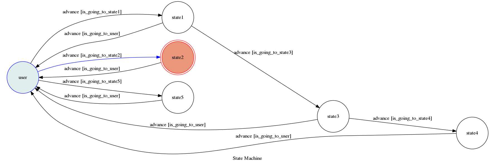

# TOC Project 2017

這是一個心情點歌機，可以輸入現在想聽神麼樣的歌
就能得到歌單


### Secret Data

`API_TOKEN` and `WEBHOOK_URL` in app.py **MUST** be set to proper values.
Otherwise, you might not be able to run your code.

### Run Locally
You can either setup https server or using `ngrok` as a proxy.

**`ngrok` would be used in the following instruction**

```sh
ngrok http 5000
```

After that, `ngrok` would generate a https URL.

You should set `WEBHOOK_URL` (in app.py) to `your-https-URL/hook`.

#### Run the sever

```sh
python3 app.py
```

## Finite State Machine


## Usage
一開始的 state 為 user 


每當user 讀到不同的字串 就會觸發 advance 到不同的 state 而 不同的 state 必須要打 `回去選歌`, `回` , `選歌` 才會回到 user 這個 state


* user
	* Input: "能給我一些糞歌嗎" or "來點糞歌" or "幹你老師點糞歌" 
		* Reply: "如果我是 dj 你會愛我嗎:
			https://www.youtube.com/watch?v=UIBlXO4OIbI
			帝雉:
			https://www.youtube.com/watch?v=WqtfKb4yYAE&list=PLVnPXvGuX__R74_huVRIWY5VyEC23NRdM
			殺梗之歌:
			https://www.youtube.com/watch?v=di6iytkal-8"

		

	* Input: "抒情的歌" or "放鬆的歌"
		* Reply: Guilty Crown - Departures ～ Blessing:
			https://www.youtube.com/watch?v=pQyjzmB_YeU&list=RDAgnrim_5pio&index=3
			Egoist - All Alone With You:
			https://www.youtube.com/watch?v=Q5eYNOnyBcU&list=RDAgnrim_5pio&index=6"

	* Input: "好心情" or "愉悅的歌"
		* Reply: closer:
			https://www.youtube.com/watch?v=PT2_F-1esPk
			Hitorigoto:
			https://www.youtube.com/watch?v=vblA_pg1kKM
* state1
	* Input: "殺梗是誰" or "那個拉風的男人是誰" or "殺梗??"
		* Reply: 殺梗 wiki:
			https://zh.wikipedia.org/wiki/Xargon
			殺梗 twitch:
			https://www.twitch.tv/xargon0731
* state3
	* Input: "他有老婆嗎？" or "他老婆是誰"
		* Reply: xargon 老婆是優格姊姊
			附上新聞網址:
			http://star.ettoday.net/news/840489


## Author
[林彥亨](https://github.com/henry0929016816)
